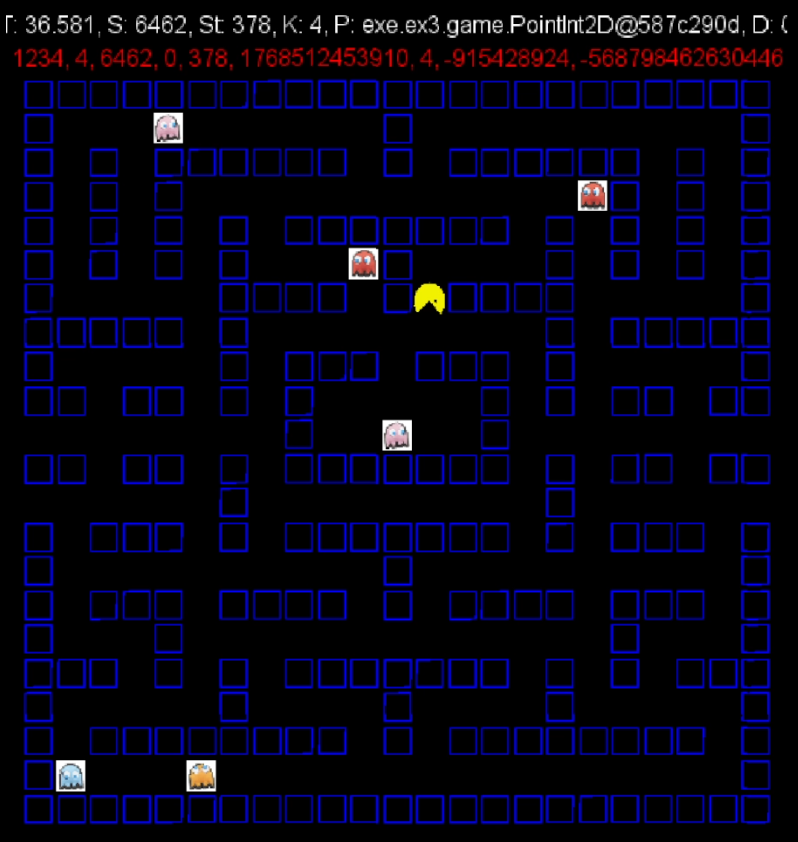

# Pac-Man Autonomous Agent & Game Engine

This project, developed as part of the Computer Science curriculum at Ariel University, features an intelligent autonomous agent designed to play Pac-Man and a custom implementation of the game environment.

---

## 🧠 Part 1: Autonomous Algorithm (`Ex3Algo`)

The `Ex3Algo` class implements the `PacManAlgo` interface to control Pac-Man automatically. It uses a state-based logic to prioritize food collection while maintaining safety.

### Core Strategy:
* **Greedy Foraging:** By default, the algorithm identifies the closest "pink" (food) pixel using a BFS-based shortest path calculation.
* **Ghost Awareness:** The agent constantly calculates the distance to all ghosts.
* **Evasion Mode (Safety Buffer):** If a ghost is detected within a distance of **6 steps** and is in its normal state, the agent switches to an evasion state.
* **Dynamic Obstacles:** During evasion, the algorithm treats the ghosts' current positions as walls (blue pixels), forcing the pathfinder to find a route that moves away from danger.
* **Emergency Maneuvers:** If no safe path to food is found while being pursued, the agent executes an emergency move to an adjacent valid tile to avoid being cornered.

## Video Example of Algo:

---

## 🎮 Part 2: Custom Game Engine

The project includes a separate, manual implementation of the Pac-Man game logic and GUI using the `StdDraw` library.

### Key Components:
* **`MyGame`**: Manages the game state, including movement logic, cyclic board behavior (wrap-around), and the status of game objects.
* **`MyGhost`**: Defines ghost entities, their types, and their transition between normal and "eatable" (green) states.
* **`myMain`**: The entry point for the custom engine, featuring a unique map layout and visual interfaces for game start, victory, and loss.
---

## ⚙️ Configuration (`GameInfo.java`)

The `GameInfo` class serves as the central configuration hub for the game. You can modify the following parameters:

| Parameter | Description |
| :--- | :--- |
| `CASE_SCENARIO` | Selects the game level (0–4). |
| `DT` | Sets the game speed/delay between frames. |
| `CYCLIC_MODE` | Determines if Pac-Man can wrap around the board edges. |
| `ALGO` | Toggles between the Autonomous Agent and Manual control. |

---

## 🛠️ How to Run

1.  **Standard Game:** Run `Ex3Main.java` to start the project with the official framework and the `Ex3Algo` agent.
2.  **Custom Implementation:** Run `myMain.java` to play the custom engine version.
    * **Space Bar:** Start/Pause the game.
    * **Arrow Keys:** Manual movement.

---

**Project Structure Note:** This project relies on `Index2D` and `Map` classes for grid-based calculations and pathfinding logic.